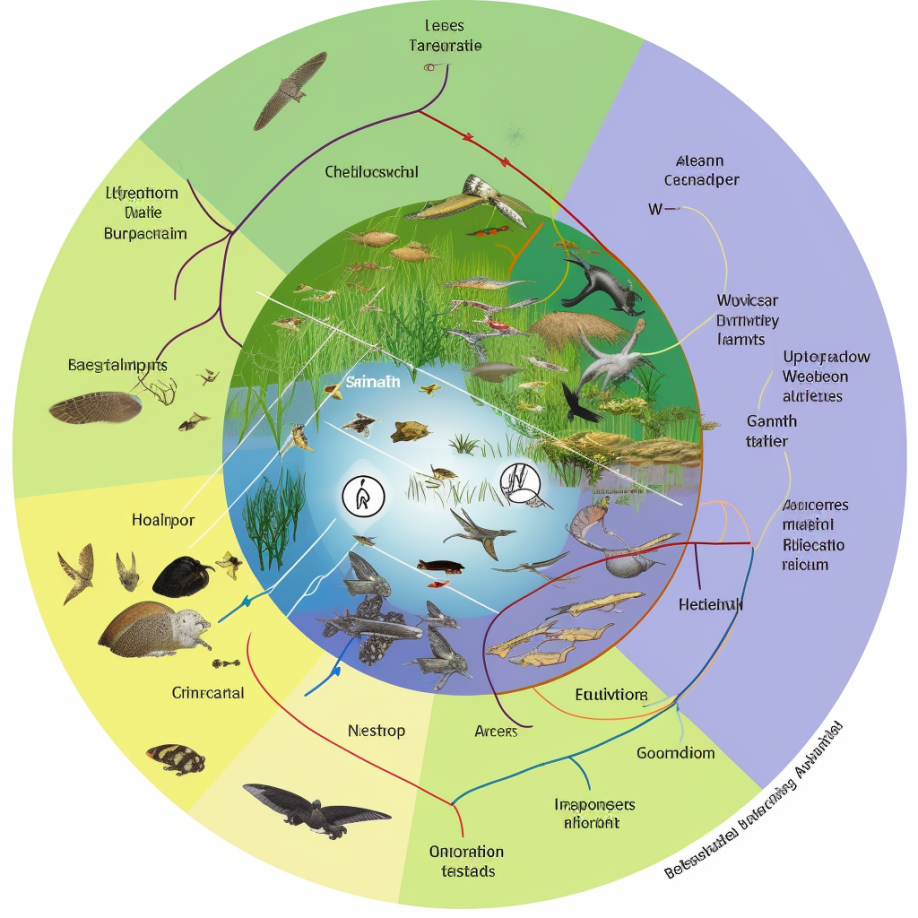
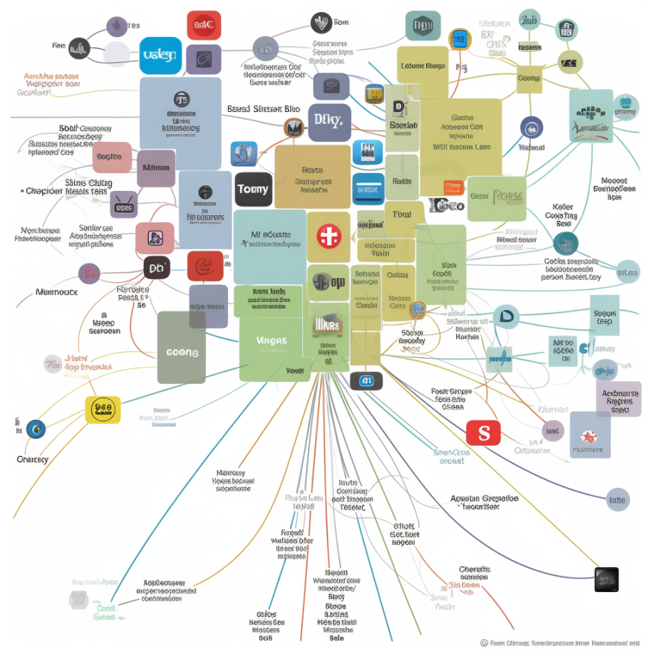

```{r setup, include=FALSE}
usethis::use_git_ignore(c("*.csv", "*.rds"))
options(htmltools.dir.version = FALSE)

library(knitr)
library(tidyverse)
library(xaringan)
library(fontawesome)
```

class: inverse, center, middle

# `r fa("fas fa-images", fill = "#fff")`

**View the slides:** 

[bretsw.com/aera23-teacher-pd](https://bretsw.com/aera23-teacher-pd/)

---

class: inverse, center, middle

# `r fa("fas fa-magnifying-glass", fill = "#fff")` <br><br> Themes

---

# `r fa("fas fa-magnifying-glass", fill = "#fff")` Range of Experiences

```{r, out.width = "100%", echo = FALSE, fig.align = "center"}
include_graphics("img/social-media-phone.jpg")
```

---

# `r fa("fas fa-magnifying-glass", fill = "#fff")` Affordances & Constraints

```{r, out.width = "100%", echo = FALSE, fig.align = "center"}
include_graphics("img/social-media-phone.jpg")
```

---

# `r fa("fas fa-magnifying-glass", fill = "#fff")` Affordances & Constraints

```{r, out.width = "720px", echo = FALSE, fig.align = "center"}
include_graphics("img/social-media-phone.jpg")
```

"Social media is not all sunshine and rainbows" [2]

---

# `r fa("fas fa-magnifying-glass", fill = "#fff")` Changes to Platforms

```{r, out.width = "600px", echo = FALSE, fig.align = "center"}
include_graphics("img/social-media-phone.jpg")
```

--

- TikTok bans

--

- Twitter algorithm

--

- Reddit tags

---

# `r fa("fas fa-magnifying-glass", fill = "#fff")` Varied Approaches

```{r, out.width = "360px", echo = FALSE, fig.align = "center"}

```

--

- Data mining of digital traces & content analysis [1] [3]

--

- "How & Why" online survey [2] 

--

- Case study [4]

--

-	Theoretical argument [5]

---

class: inverse, center, middle

# `r fa("fas fa-person-chalkboard", fill = "#fff")` <br><br> Insights

---

# `r fa("fas fa-person-chalkboard", fill = "#fff")` Foundational Frameworks

```{r, out.width = "600px", echo = FALSE, fig.align = "center"}
include_graphics("img/frame.jpg")
```

--

- **Affordances & Constraints** [1] [2] [3] [4] [5]

--

- **Affinity spaces** [1] [2] [3]

---

# `r fa("fas fa-person-chalkboard", fill = "#fff")` Key Terms

```{r, out.width = "600px", echo = FALSE, fig.align = "center"}

```

- **Overposting** instead of "sharing" [5]

--

- **Social comparison** [2] [4]

--

- **Legitimate peripheral participation** instead of "lurking" [2]

---

class: inverse, center, middle

# `r fa("far fa-compass", fill = "#fff")` <br><br> Recommendations <br> for <br> More Consequential <br> Education Research

---

# `r fa("far fa-compass", fill = "#fff")` Teachers' Agency

```{r, out.width = "360px", echo = FALSE, fig.align = "center"}

```

--

- Self-directing their learning: **Why?** [1]

--

- Organizing around shared affinity: **Why?** [1] [2] [3]

--

- **Pedagogical design capacity:** Resisting the constraints of the Teacher-to-teacher Online Marketplace of Ideas (TOMI): **Why?** [4]

---

# `r fa("far fa-compass", fill = "#fff")` Teachers' Agency

```{r, out.width = "360px", echo = FALSE, fig.align = "center"}

```

**Teacher agency is a finite resource,**

--

**with limited influence and power.**

---

# `r fa("far fa-compass", fill = "#fff")` Digital Literacy

```{r, out.width = "360px", echo = FALSE, fig.align = "center"}

```

"Many participants appeared to use TikTok with limited awareness of how the platform works and related issues that could impact educators" [2]

---

# `r fa("far fa-compass", fill = "#fff")` Digital Literacy

```{r, out.width = "360px", echo = FALSE, fig.align = "center"}

```

- Imagined audiences, context collapse, and real consequences [5]

--

- Teacher-to-teacher Online Marketplace of Ideas (TOMI) [4]

--

- Networked publics [2]

---

# `r fa("far fa-compass", fill = "#fff")` Digital Literacy

```{r, out.width = "360px", echo = FALSE, fig.align = "center"}

```

**No one knows how to do these things naturally;**

--

**Digital literacy must be learned.**

---

# `r fa("far fa-compass", fill = "#fff")` Systems Thinking

```{r, out.width = "540px", echo = FALSE, fig.align = "center"}

```

---

# `r fa("far fa-compass", fill = "#fff")` Systems Thinking

```{r, out.width = "540px", echo = FALSE, fig.align = "center"}

```

---

# `r fa("far fa-compass", fill = "#fff")` Systems Thinking

```{r, out.width = "360px", echo = FALSE, fig.align = "center"}

```

"The complexity and interconnectedness underlying beginning teachers’ challenges need to be addressed with institutional or organizational efforts alongside individual endeavors." [1]

--

"Educators can address policies, reconsider practices, and encourage pedagogy" [5]

---

# `r fa("far fa-compass", fill = "#fff")` Systems Thinking

```{r, out.width = "360px", echo = FALSE, fig.align = "center"}

```

"Such support could supplement the support alumni receive from formal mentors, and/or compensate for potential shortcomings in school district induction programs" [3]

--

"Future research could build upon the results of this research by attending to how the technological context shapes interactions with alumni" [3]

---

# `r fa("far fa-compass", fill = "#fff")` Systems Thinking

```{r, out.width = "360px", echo = FALSE, fig.align = "center"}

```

"We see implications for new teacher induction programs, early career mentorship programs, and in-service professional learning" [4]

--

"Teacher education programs must acknowledge that teachers learn how to teach in a host of formal and informal spaces, including on social media and through curricular materials they find online" [4]

---

# `r fa("far fa-compass", fill = "#fff")` Systems Thinking

```{r, out.width = "360px", echo = FALSE, fig.align = "center"}

```

**Socio-Ecological Model:** [1]

- Individual
- Interpersonal
- Organizational
- Community
- Public policy 

---

# `r fa("far fa-compass", fill = "#fff")` Systems Thinking

```{r, out.width = "360px", echo = FALSE, fig.align = "center"}

```

**Socio-Ecological Model:** `r fa("fas fa-arrow-right", fill = "#782F40")` Our interpretations, implications, recommendations

- Individual
- Interpersonal
- Organizational
- Community
- Public policy 

---

class: inverse, center, middle

**Bret Staudt Willet** | Florida State University

`r fa("envelope", fill = "#fff")` [bret.staudtwillet@fsu.edu](mailto:bret.staudtwillet@fsu.edu) | `r fa("globe", fill = "#fff")` [bretsw.com](https://bretsw.com) | `r fa("fab fa-github", fill = "#fff")` [GitHub](https://github.com/bretsw/)